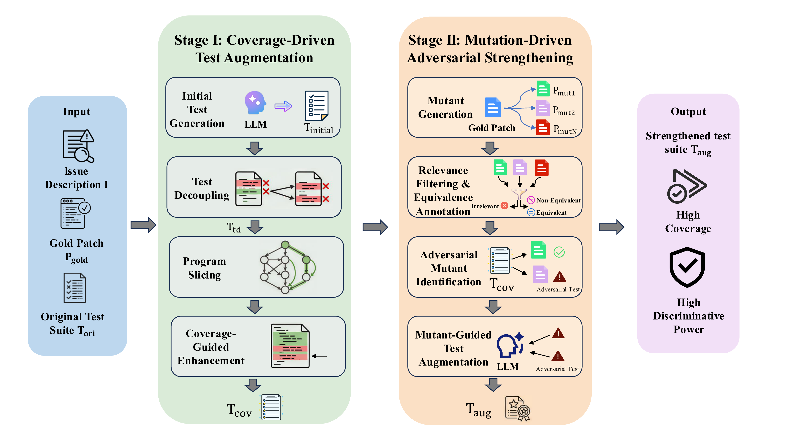
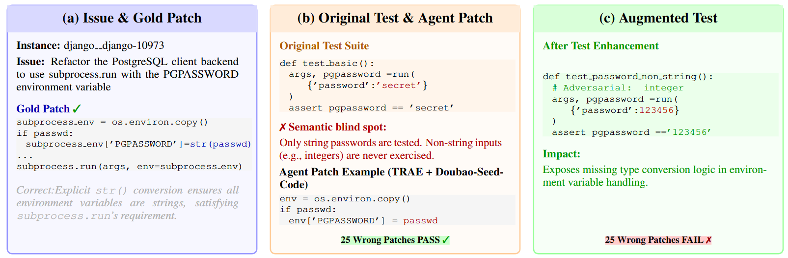

# SWE-ABS

[](https://your-leaderboard-url.com)
[](https://huggingface.co/datasets/OpenAgentLab/SWE-ABS)
[](https://arxiv.org/abs/your-paper-id)
[](LICENSE)

**SWE-ABS** is an automated framework for constructing high-quality software engineering benchmarks. It generates test patches, produces mutation patches to challenge those tests, and validates them with augmented tests — providing a scalable pipeline for evaluating the abstract correctness of code fixes.

---

## Overview

SWE-ABS consists of three sequential pipelines that transform raw SWE-bench instances into a validated benchmark:

```
SWE-bench Instances
       │
       ▼
┌─────────────────────┐
│  Stage 1            │  Test Generation
│  run_stage1_auto.py │  Agent generates test patches → validates with gold patch → optimizes coverage
└─────────┬───────────┘
          │  preds.json
          ▼
┌─────────────────────┐
│  Mutation Generation│
│  run_stage_         │  LLM generates N mutation patches per instance → tests + judges equivalence
│  mutation_gen.py    │
└─────────┬───────────┘
          │  preds.json (with mutation fields)
          ▼
┌─────────────────────┐
│  Mutation Aug       │
│  run_stage_         │  Agent generates augmented tests that pass gold patch but fail mutations
│  mutation_aug.py    │
└─────────────────────┘
          │
          ▼
    SWE-ABS Benchmark
```



### Motivating Example



A real Django instance (`django__django-10973`) illustrates why strong tests matter. The original test suite only covers string passwords, allowing 25 semantically incorrect agent patches to silently pass. SWE-ABS generates an augmented test with a non-string input that exposes the missing `str()` conversion, causing all 25 wrong patches to fail.

---

## Project Structure

```
SWE-ABS/
├── mini-swe-agent/            # Main pipeline scripts
│   ├── run_stage1_auto.py     # Stage 1: Test Generation
│   ├── run_stage1.sh
│   ├── run_stage_mutation_gen.py   # Mutation Generation
│   ├── run_stage_mutation_gen.sh
│   ├── run_stage_mutation_aug.py   # Mutation Augmentation
│   ├── run_stage_mutation_aug.sh
│   └── src/minisweagent/      # Agent framework
├── swe-bench/                 # SWE-bench evaluation harness
├── SWE-bench_Pro-os/          # SWE-bench Pro evaluation
├── sweabs_utils/              # Shared utilities
├── data/image/                # Paper figures and assets
├── docs/                      # Pipeline guides
└── pyproject.toml
```

---

## Installation

```bash
conda create -n swe-abs python=3.11
conda activate swe-abs
bash setup.sh
```

Verify: `python test/test_cross_package_imports.py` → `Total: 5/5 tests passed`

---

## Running the Pipelines

### Prerequisite — Extract Gold Patch Line Numbers

Before running Stage 1, extract the executable lines covered by each instance's gold patch. Stage 1 uses this information to guide coverage-based test validation.

```bash
cd swe-bench
bash get_line_number.sh
```

Or with custom options:

```bash
cd swe-bench
python -m swebench.runtest.get_line_number \
    --dataset_name princeton-nlp/SWE-bench_Verified \
    --run_id validate-gold \
    --max_workers 8
    # --instance_ids pylint-dev__pylint-6386
```

**Output**: `swe_plus_res/modified_raleted_lines/final_results.json`


---

### Stage 1 — Test Generation

Generates test patches for SWE-bench instances using an LLM agent, validates them against the gold patch, and improves coverage.

```bash
cd mini-swe-agent
bash run_stage1.sh
```

Or with custom options:

```bash
python run_stage1_auto.py \
    --output result/model_gen_test \
    --model openai/gpt-5 \
    --run-id my_run \
    --workers 4 \
    --benchmark swebench \
    --subset verified
```

**Output**: `result/model_gen_test/{run-id}/preds.json`

See [Stage 1 Guide (EN)](docs/stage1_guide_en.md) · [中文](docs/stage1_guide_zh.md)

---

### Mutation Generation

Takes Stage 1's `preds.json` and generates N mutation patches per instance. An LLM judge classifies each mutation as equivalent or non-equivalent.

```bash
cd mini-swe-agent
bash run_stage_mutation_gen.sh
```

Or with custom options:

```bash
python run_stage_mutation_gen.py \
    --output result/model_gen_test/my_run \
    --model zai/glm-4.7 \
    --run-id mutation_gen \
    --required-mutations 2 \
    --workers 4
```

**Input**: Stage 1 `preds.json`
**Output**: `preds.json` updated with `all_mutatation_patch` and `judge_info` fields

See [Mutation Generation Guide (EN)](docs/mutation_gen_guide_en.md) · [中文](docs/mutation_gen_guide_zh.md)

---

### Mutation Augmentation

Merges Stage 1 and Mutation Generation outputs, then generates augmented tests that distinguish non-equivalent mutations from the gold patch.

```bash
cd mini-swe-agent
bash run_stage_mutation_aug.sh
```

Or with custom options:

```bash
python run_stage_mutation_aug.py \
    --stage1-preds result/model_gen_test/my_run/preds.json \
    --stage2-output result/model_gen_test/my_run/mutation_gen \
    --output result/mutation_aug \
    --run-id my_aug_run \
    --model openai/gpt-5 \
    --required-mutations 2 \
    --max-aug-retries 3
```

**Input**: Stage 1 `preds.json` + Mutation Generation `set{i}/preds.json`
**Output**: `result/mutation_aug/{run-id}/preds_*_eval.json`

See [Mutation Augmentation Guide (EN)](docs/mutation_aug_guide_en.md) · [中文](docs/mutation_aug_guide_zh.md)

---

### Benchmark Evaluation — Evaluate Agent Patches

Once you have a benchmark (augmented test patches), evaluate existing agent patches from the SWE-bench leaderboard to measure ranking changes.

**Setup**: Download agent patches into a local directory (one folder per model, named by model key):

```
topk_swe_data/
├── 20250807_openhands_gpt5/
├── 20250522_tools_claude-4-sonnet/
└── ...
```

**Run evaluation**:

```bash
cd swe-bench
bash eval_agent_leaderboard.sh
```

Or with custom options:

```bash
cd swe-bench
python -m swebench.runtest.run_evaluation_test \
    --predictions_test_path /path/to/your/preds.json \
    --vaild_model_path ~/topk_swe_data \
    --vaild_model_name 20250807_openhands_gpt5,20250522_tools_claude-4-sonnet \
    --run_id my_eval_run \
    --max_workers 12 \
    --timeout 120
```

**Output**: `swe_plus_res/eval_agent/{run_id}/final_results.json`

Each instance in the output records which agent patches passed or failed the augmented tests:

```json
{
  "<instance_id>": {
    "pass": ["<model_key>", ...],
    "fail": ["<model_key>", ...]
  }
}
```

---

### Leaderboard Analysis — Compare Rankings

After evaluation, analyze how each model's score and rank changed under SWE-ABS:

```bash
python tool_script/analyze_leaderboard.py \
    --results swe-bench/swe_plus_res/eval_agent/<run_id>/final_results.json \
    --key-map data/key_map_top30.json
```

Example output:

```
Model                                                Orig (%)  SWE-ABS (%)   Drop (%)           Rank
------------------------------------------------------------------------------------------------------
OpenHands + GPT-5 (20250807)                            65.20%       52.40%      12.80%        1 → 3 *
mini-SWE-agent + GPT-5.2 (20251211)                     63.80%       55.10%       8.70%        2 → 1 *
Prometheus-v1.2.1 + GPT-5 (20251015)                    61.40%       50.20%      11.20%        3 → 4
...

Summary:
  Models evaluated       : 30
  Instances evaluated    : 500
  Strengthened instances : 312
  Killed patches         : 847
  Average score drop     : 9.45%
  Models with rank change: 18
```

The `key_map_top30.json` maps internal model keys to display names. Update `data/key_map_top30.json` to include any additional models you want to analyze.


---

## Documentation

| Document | Description |
|----------|-------------|
| [docs/stage1_guide_en.md](docs/stage1_guide_en.md) | Stage 1: Test Generation pipeline guide |
| [docs/stage1_guide_zh.md](docs/stage1_guide_zh.md) | Stage 1：测试生成流水线使用指南 |
| [docs/mutation_gen_guide_en.md](docs/mutation_gen_guide_en.md) | Mutation Generation pipeline guide |
| [docs/mutation_gen_guide_zh.md](docs/mutation_gen_guide_zh.md) | Mutation Generation 流水线使用指南 |
| [docs/mutation_aug_guide_en.md](docs/mutation_aug_guide_en.md) | Mutation Augmentation pipeline guide |
| [docs/mutation_aug_guide_zh.md](docs/mutation_aug_guide_zh.md) | Mutation Augmentation 流水线使用指南 |
| [INSTALLATION_GUIDE.md](INSTALLATION_GUIDE.md) | Detailed installation and troubleshooting |

---

## Acknowledgements

SWE-ABS is built on top of the following open-source projects:

- **[mini-swe-agent](https://github.com/SWE-agent/mini-swe-agent)** — The lightweight agent framework used for test generation and augmentation. MIT License, Copyright (c) 2025 Kilian A. Lieret and Carlos E. Jimenez.
- **[SWE-bench](https://github.com/princeton-nlp/SWE-bench)** — The software engineering benchmark harness used for evaluation. MIT License, Copyright (c) 2023 Carlos E Jimenez, John Yang, Alexander Wettig, Shunyu Yao, Kexin Pei, Ofir Press, Karthik R Narasimhan.
- **[SWE-bench Pro](https://github.com/scaleapi/SWE-bench_Pro-os)** — Extended evaluation harness for long-horizon tasks. Copyright (c) Scale AI.
